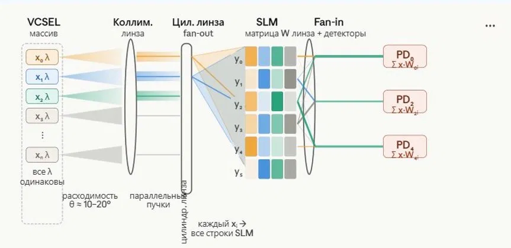

# optical_sim — CUDA оптический симулятор

## Требования
- CUDA Toolkit ≥ 12.0
- CMake ≥ 3.20
- GCC ≥ 11 (нужен C++17 для `std::filesystem`)
- GPU: RTX 30xx/40xx (sm_86/sm_89) или H100 (sm_90)

## Сборка на сервере

```bash
# 1. Клонируем / копируем проект
cd optical_sim

# 2. Скачиваем stb_image_write (header-only, нужен для PNG)
wget -q https://raw.githubusercontent.com/nothings/stb/master/stb_image_write.h \
     -O include/stb_image_write.h

# 3. Собираем
mkdir build && cd build
cmake .. -DCMAKE_BUILD_TYPE=Release
make -j$(nproc)

# 4. Запускаем тесты
ctest --output-on-failure

# 5. Запускаем симулятор
#    Аргументы: [num_sources] [slm_cols]
./optical_sim          # дефолт: 6 источников, SLM 256×6
./optical_sim 8 512    # 8 источников, SLM 512×8
```

## Что получим в ./output/
```
1_source.png      — распределение интенсивности массива VCSEL
2_collimator.png  — после коллимирующей линзы
3_cyl_lens.png    — после цилиндрической линзы (fan-out)
4_slm.png         — поле на SLM (с применённой маской)
5_detector.png    — поле на детекторах
```
Все изображения в colormap **inferno**, нормированы к [0, 1].

## Структура проекта
```
optical_sim/
├── include/
│   ├── config.hpp       — SystemConfig, Plane, PlaneID
│   ├── field.hpp        — ComplexField, IntensityMap, CUDA_CHECK
│   ├── propagator.hpp   — Operator, объявления build_* и apply_propagator
│   └── pipeline.hpp     — fan_out, apply_slm, fan_in, intensity API
├── kernels/
│   ├── fresnel.cu       — PropagatorSinc (интегралы Френеля на GPU)
│   ├── lens.cu          — CrossLens, CylindLens
│   ├── fan.cu           — fan-out, fan-in, apply_slm
│   └── intensity.cu     — |E|², нормализация, PNG (stb)
├── src/
│   └── main.cpp         — пайплайн: SOURCE→COLLIM→CYL→SLM→DETECTOR
└── tests/
    ├── test_field.cu    — аллокация, upload/download, intensity
    └── test_fresnel.cu  — унитарность оператора Френеля
```

## Следующие шаги
- [ ] Заменить наивное матричное умножение на cuBLAS (`cublasZgemm`)
- [ ] Добавить OpenGL/EGL визуализацию в реальном времени
- [ ] Параллельный запуск нескольких источников через CUDA streams
- [ ] Экспорт данных в numpy (.npy) для сравнения с Python версией


# Графическая схема

  